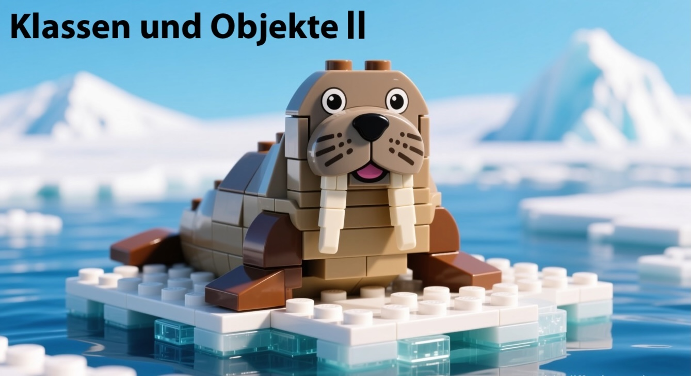
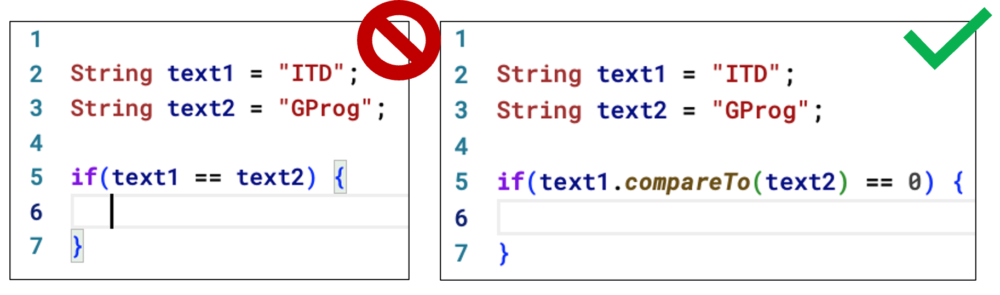
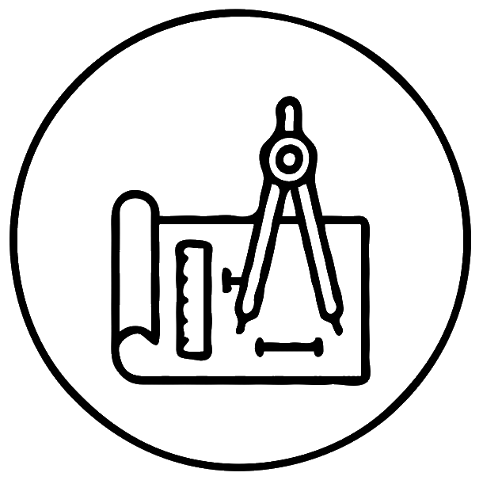
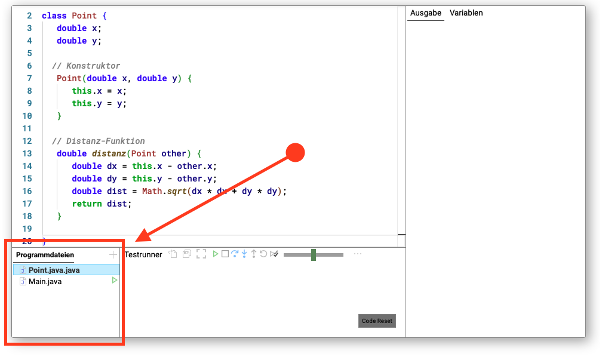

---
format:
  revealjs:
    slide-number: true
    css: styles.css
    width: 1200
    height: 700
    auto-stretch: false
    incremental: true
---

# 

{width="100%" fig-align="center"}

# Die _String_-Klasse

<br>

`String text = "GProg";`

---

- `toLowerCase` Umwandlung in Kleinbuchstaben
  - z.B. `"ITD".toLowerCase()` → `"itd"`

- `toUpperCase` Umwandlung in Großbuchstaben
  - z.B. `"itd".toUpperCase()` → `"ITD"`

- `length` gibt die Länge des Strings zurück
  - z.B. `"ITD".length()` → 3

- `charAt` Zugriff auf ein einzelnes Zeichen
  - z.B. `"ITD".charAt(1)` → `'T'`

- `substring` extrahiert einen Teilstring
  - z.B. `"ITD".substring(0, 2)` → `"IT"`

---

- `contains` prüft, ob ein String eine Teilzeichenkette enthält
  - z.B. `"ITD".contains("TD")` → `true`

- `startsWith` prüft, ob String mit bestimmter Zeichenkette beginnt
  - z.B. `"ITD".startsWith("I")` → `true`

- `endsWith` prüft, ob String mit bestimmter Zeichenkette endet
  - z.B. `"ITD".endsWith("D")` → `true`

- `equals` vergleicht zwei Strings auf Gleichheit
  - z.B. `"ITD".equals("ITD")` → `true`

- `equalsIgnoreCase` ignoriert Groß-/Kleinschreibung
  - z.B. `"ITD".equalsIgnoreCase("itd")` → `true`

---

- `trim` entfernt führende und nachfolgende Leerzeichen
  - z.B. `"  ITD  ".trim()` → `"ITD"`

- `replace` ersetzt Zeichen oder Teilstrings
  - z.B. `"ITD".replace("T", "X")` → `"IXD"`

- `split` teilt einen String anhand eines Trennzeichens
  - z.B. `"I,T,D".split(",")` → `["I", "T", "D"]`

- `indexOf` gibt den Index eines Teilstrings zurück
  - z.B. `"ITD".indexOf("T")` → 1

- `lastIndexOf` gibt den letzten Index eines Teilstrings zurück
  - z.B. `"ITDIT".lastIndexOf("T")` → 4

## Beispiel: Strings ⌨️ 

<iframe src="embed_new.html?id=gprog-string-examples" width="1000" height="600" frameborder="0"></iframe>

## Strings vergleichen

<br>

:::: {.columns}

::: {.column width="20%"}

{width="100%" fig-align="center"}

🍎 != 🍐

:::

::: {.column width="80%"}

**Achtung**: Strings in Java **nicht** mit `==` vergleichen!

<br>

_Warum nicht?_  

<br>

Der `==`-Operator vergleicht Referenzen, d.h. Speicheradressen, und nicht Inhalte.
:::


::::

## Beispiel: Strings vergleichen 

Wir verwenden anstelle von `==` die Methode `compareTo` bzw. `equals`:

{width="100%" fig-align="center"}


# Die _Math_-Klasse

{height="300px" fig-align="right"}

---

- **Winkel**-Funktionen:
  - Maßeinheit meistens _Radiant_, Datentyp `double`
  - `cos` / `acos`, `sin` / `asin` und `tan`/ `atan`
  - Umrechungnungsfunktionen `toDegrees`und `toRadians`
- **Numerische** Funktionen:
  - `ceil` fürs Aufrunden zur nächsten ganzen Zahl
  - `floor` fürs Abrunden zur nächsten ganzen Zahl
  - `abs` für den Betrag (nur positiv)

---

- **Exponential-/Logarithmus**-Funktionen:
  - `pow` für $x^y$ 
  - `log` für den natürlichen Logarithmus $ln(x)$
  - `log10` für Logarithmus zur Basis 10
  - `exp` für die Exponentialfunktion $e^x$

# Grafik-Klassen

---
## Geometrische Primitive

- `Line` für Linien 
- `Circle` für Kreise
  - 🔄 Recap: auch zum Zeichnen von Punkten
- `Triangle` für Dreiecke
- `Rectangle` für Vierecke
- `Polygon` für Vielecke

## Weitere Grafik-Klassen

- `Ellipse` für Ellipsen
- `Arc` für Kreisbögen
- `Sector` für Kreissektoren
- `World` zum Erstellen einer eigenen Zeichenfläche
  - damit lassen sich Hintergrund und Fenstergrößen konfigurieren
- `Bitmap` zum Zeichnen von Pixelgrafiken
  - auch für Hintergründe, Spielcharaktere usw.

## Wichtige _Grafik_-Methoden

- `setFillColor` zum Setzen der Vordergrundfarbe
  - für die meisten geometrischen Primitive verfügbar
- `setBorderColor` zum Setzen der Linienfarbe (Ränder)
- `setBackgroundColor` zum Setzen der Hintergrundfarbe
  - vor allem für `World`-Objekt


## Beispiel: Formen

<iframe src="embed_new.html?id=gprog-class-forms" width="1000" height="600" frameborder="0"></iframe>

# Arbeiten mit Klassen in Java

## Eine Datei für _jede_ Klasse

{height="600px" fig-align="center"}

## _Konstruktoren_ in der Praxis {auto-animate="true"}

<br>
🔄 Unsere Point-Klasse:

```java
class Point {
   double x;
   double y;
}
```

## {auto-animate="true"}

<br>
🔄 Unsere _Point_-Klasse:

```java
class Point {
   double x;
   double y;

   // Konstruktor
   Point(double x, double y) {
      this.x = x;
      this.y = y;
   }
}
```

## {auto-animate=true}

<br>
🔄 Unsere _Point_-Klasse:

```java
class Point {
   double x;
   double y;

   // Konstruktor
   Point(double x, double y) {
      this.x = x;
      this.y = y;
   }

   // Konstruktor ohne Parameter
   Point() {
      this.x = 0.;
      this.y = 0.;
   }

}
```

**Geht das auch eleganter? 🤔**

## {auto-animate=true}

<br>
🔄 Unsere _Point_-Klasse:

```java
class Point {
   double x;
   double y;

   // Konstruktor
   Point(double x, double y) {
      this.x = x;
      this.y = y;
   }
}
```

**Geht das auch eleganter? 🤔**


## {auto-animate=true}

<br>
🔄 Unsere _Point_-Klasse:

```java
class Point {
   double x;
   double y;

   // Konstruktor
   Point(double x, double y) {
      this.x = x;
      this.y = y;
   }

   // Konstruktor ohne Parameter
   Point() {
      this(0., 0.);
   }
}
```

**Ja, Konstruktoren können sich gegenseitig aufrufen!**

## </>-Aufgabe _MyTriangle_ 🔺

{width="50%" fig-align="center"}

**Erweitere die gegebene _MyTriangle_-Klasse um weitere Konstruktoren.**


## </>-Lösung _MyTriangle_ 🔺

<iframe src="embed_triangle_task.html?id=gprog-class-mytriangle" width="1000" height="600" frameborder="0"></iframe>


# ✅ Zusammenfassung 

::::: {.columns}

:::: {.column width="85%"}

- Klassen **String** und **Math** bieten viele Hilfsmethoden  
&nbsp;&nbsp; → erst prüfen, ob Funktionalität schon verfügbar ist
- In Java gehört **jede Klasse in eigene Datei**
<br>&nbsp;&nbsp; → Code bleibt so auch übersichtlicher 
- **Mehrere Konstruktoren** machen Klassen flexibler 
<br>&nbsp;&nbsp; → wichtige Parameter darüber konfigurierbar machen 
- Konstrukturen können sich **gegenseitig aufrufen**
<br>&nbsp;&nbsp; → minimiert Wiederholungen und Fehler 

::::

:::: {.column width="15%"}
  {width="75%" fig-align="center"}
  {width="100%"}
::::

:::::

